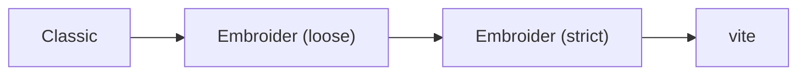
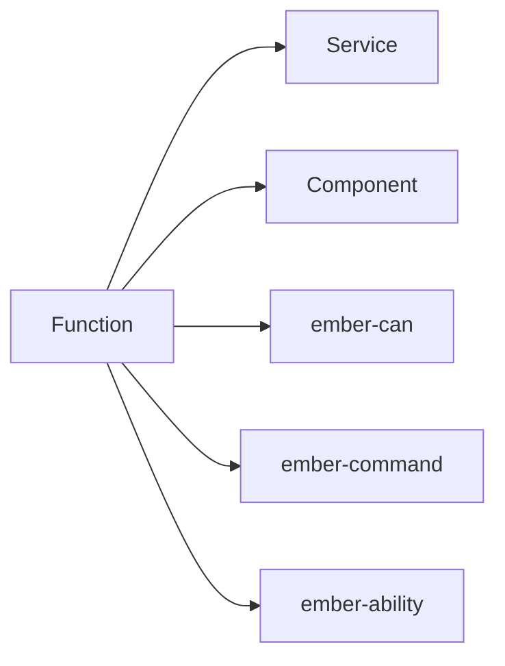

<!-- markdownlint-disable -->

# CQS in Reactive Ember

aka. how to use functions in a reactive environment with access to Ember's DI system

<div class="absolute bottom-10">
  <span class="font-700">
    Thomas Gossmann - 
    <a href="https://gos.si" target="_blank">gos.si</a> - 
    <a href="https://bsky.app/profile/gos.si" target="_blank">@gos.si</a>
  </span>
</div>

<div class="absolute bottom-10 right-10">
  <span class="font-700">
    <a href="https://clark.io" target="_blank"></a>
  </span>
</div>

---
layout: full
---

# More Technical Details to my Emberfest Talk

for the curios, no prerequisite for this deck

<Youtube id="GkPXdC32t3Q" width="100%" height="70%" />

Slides for [Scalable Frontend Architecture That Meets Your Business @
Notist](https://noti.st/gossi/a8pBoc/scalable-frontend-architecture-that-meets-your-business)

---
layout: section
---

### Part 1

# Finding Solutions

## What Influences our Thinking?

---
layout: two-cols-header
---

# Your Task

Implement a button to accept a ride, but only show to the user when certain
conditions are met

::left::

## You Think ...

- What component(s) do I need?
- Do I need to create a component?
- Do I need to create a helper?
- What services do I need?

... _Framework ?_ 

::right::

## You Think ...

- Does that action already exist? Can I use it?
- Do I need to create that action?
- What are the factors for the guard?
- Where they are available?

... _Product ?_

---
layout: full
---

# Frameworker vs. Software Engineer

<Youtube id="ObCvAUx6gbY" width="100%" height="90%" />

---
layout: two-cols
---

# With Commentary

<Youtube id="UowtlZB2a70"/>

::right::

# Software Engineer

- Experience
- Advanced instincts and gut feeling
- Better at decision making, eg:
  - When (and when not) to abstract?
  - What to abstract?
  - Which abstraction is the best in the given situation?

---
layout: two-cols
---

# Framework Thinking<br> (in Ember)

- Buisness logic is part of the UI layer<br> (= components)
- Services as escape hatch for business logic
- Functions are for utils
- Your code is architectured how the framework works
- Bury mission critical code below "framework clutter"

::right::

<v-click>

# Drawbacks

- Your business has a hard dependency on a framework
- Non-testable code
- Unmaintainable code
- Hard to extend

</v-click>

---
layout: section
---

### Part 2

# Relevancy of Code to Business

---
layout: two-cols-header
---

# Functions are NOT Utils (maybe some)

- Functions carry semantics and meaning
- Functions are of different severance for the success of your business
- (They all can fail due to technical reasons, ie NPE)
- They are nice for composable functional/procedural code

::left::

<v-click>

## Critical Functions

- Contain business logic
- A failure can lead to <span v-mark.underline.orange>significant revenue loss</span>
- They are your heartbeat
</v-click>

::right::

<v-click>

## Utility Function

- Complementary to the business
- eg. give you the locale string for a domain object
- A failure is "neglectable" (may cause "weird rendering")

</v-click>

---
layout: center
---

# Let's Focus on Critical Functions for Business Logic

They come in two flavors: **Commands** and **Queries**


---
layout: two-cols
---

<div class="absolute text-center bottom-30px" v-click>

## Command-Query-Separation (CQS)

Functions to either be commands that perform an action or queries that respond data, but neither both!
</div>

# Queries

```ts
function query(...args: unknown[]): NonNullable<unknown>;
```

- _Read_
- Questions: Ask facts about the system
- Abilities/Authorization/Guards/Conditions/Criteria: Control acces

::right::

# Commands

```ts
function command(...args: unknown[]): void;
```

- _Write_
- Fire & Forget
- May/should cause side effects

---
layout: section
---

### Part 3

# Examples

## Spotting CQS in the Wild

---
layout: two-cols-header
---

# Queries: Presentation Logic / Control Flow

<p class="text-align-center">
  <ph-arrow-elbow-left-down/>
  Two Times Business Logic. Two Times Anti-Patterns
  <ph-arrow-elbow-right-down/>
</p>

::left::

<v-click>

## Helper

```gts
{{#if (feature-flag 'PROPLUS')}}
  Special Feature here
{{/if}}
```

</v-click>

<v-clicks at="3">

<ul class="absolute left-30px bottom-30px w-100">
  <li> What's the name of the feature?<br>
  <small>hint: it is not "Pro Plus", that's only the
  feature flag currently used for its condition</small></li>
  <li>Not unit testable :(</li>
</ul>

</v-clicks>

::right::

<v-click at="2">

## Components

```gts
import Component from '@glimmmer/component';
import { service } from '@ember/service';
import type FeaturesService from 'whereever/features-infra-sits';

class Search extends Component {
  @service declare features: FeaturesService;

  get isProPlus() {
    return this.features.has('PROPLUS');
  }

  <template>
    {{#if this.isPropPlus}}
      Special Feature here
    {{/if}}
  </template>
}
```

</v-click>

---

# Queries: Data Fetching

- Fetching data from your API
- Business logic part:
  - Endpoint
  - Parameters
  - Payload structure

---
layout: two-cols-header
---

# Commands: Actions

::left::

## Components

```gts
import Component from '@glimmer/component';
import { action } from '@ember/object'; 
import { AnotherComponent } from 'your-ui';

class Expose extends Component {
  @action
  onClick() {
    // whatever happens here
  }

  <template>
    <AnotherComponent @onClick={{this.onClick}}>
      Something sits here
    </AnotherComponent>
  </template>
}
```

::right::

## Services

```ts
import Service from '@ember/service';

class UserService extends Service {
  createUser(data) {
    // ...
  }

  deleteUser(userId: number) {
    // ...
  }
}
```


---
layout: section
---

### Part 4

# Ember Constraints

## What to consider when integrating functions in Ember

---

# Services

Services is an overloaded Term

<br>
<div class="grid grid-cols-[1fr_1fr_1fr]">
  <div v-click="1" v-mark.green="{ at: 4, type: 'bracket', brackets: 'bottom', padding: [5, -20, 5, 0]}">
    <h2>Infrastructure Services</h2><br>
    <ul>
      <li>API client</li>
      <li>Messaging / Message Broker</li>
    </ul>
  </div>
  <div v-click="2" v-mark.green="{ at: 4, type: 'bracket', brackets: 'bottom', padding: [5, -20, 5, 0] }">
    <h2>Application Services</h2><br>
    <ul>
      <li>Session</li>
      <li>Features</li>
      <li>A/B Testing</li>
    </ul>
  </div>
  <div v-click="3">
    <h2>Domain Services</h2><br>
    <ul>
      <li>Domain Objects (CRUD)</li>
      <li>e.g. UsersService</li>
    </ul>
  </div>
</div>

---

# Build System



- Embroider (strict) + vite require statically analyzable code
- for tree shaking/chunk generation
- ...

---
layout: two-cols-header
---

# Components

::left::

## Today

Multi-File-Component (MFC)

- `.hbs` + `.ts`
- Backing class needed fairly often
- Relies on Ember-resolver
- Statically NOT analyzable

::right::

## Tomorrow

Single-File-Component (SFC)

- `.gts`
- (Template) Imports
- Backing class needed way less frequently
- Statically analyzable


---
layout: two-cols-header
---

# Component: Today

::left::

```ts
// component.ts
import { service } from '@ember/service';
import Component from '@glimmer/component';

class RideActions extends Component {
  @service api;
  @service user;

  canAccept = (ride: Ride) => {
    // ...
  }

  accept = (ride: Ride) => {
    // ...
  }
}
```

::right::

```hbs
{{! component.hbs }}

{{#if (this.canAccept @ride)}}
  <button type="button" {{on "click" (fn this.accept @ride)}}>
    Accept
  </button>
{{/if}}
```

---

# Component: Tomorrow

```glimmer-ts
import { accept as upstreamAccept, canAccept as upstreamCanAccept } from './domain';

const canAccept = () => {
  // ...
};

const accept = () => {
  // ...
};

<template>
  {{#if (canAccept @ride)}}
    <button type="button" {{on "click" (fn (accept) @ride)}}>
      Accept
    </button>
  {{/if}}
</template>
```


---
layout: section
---

### Part 5

# Focussing on the Product

## Turn Critical Pieces into Functions

---
layout: two-cols-header
---

# Rideshare Example

::left::

```ts
interface User {
  id: string;
  name: string;
  type: 'rider' | 'driver';
}

type RideState = 
  | 'requested'
  | 'declined'
  | 'awaiting_pickup'
  | 'driving'
  | 'arrived'
  | 'payed'
  | 'canceled';

interface Ride {
  id: string;
  from: string;
  to: string;
  riderId: string;
  driverId: string;
  state: RideState;
}
```

::right::

```ts
// actions
function request(ride: Ride, rider: User): void;
function accept(ride: Ride, driver: User): void;
function drive(ride: Ride, driver: User): void;
function arrive(ride: Ride, driver: User): void;
function pay(ride: Ride, rider: User): void;
function cancel(ride: Ride, user?: User): void;

// guards rsp. abilities
function canRequest(ride: Ride, user: User): boolean;
function canAccept(ride: Ride, user: User): boolean;
function canDrive(ride: Ride, user: User): boolean;
function canDecline(ride: Ride, user: User): boolean;
function canArrive(ride: Ride, user: User): boolean;
function mustPay(ride: Ride, rider: User): boolean;

// questions
function isDriver(user: User): boolean;
function isRider(user: User): boolean;
function isDriverFor(ride: Ride, driver: User): boolean;
function calculateTravelDistance(ride: Ride): number;
```
---
layout: two-cols
---

# Action: `accept()`

```ts
import type { APIClient } from 'infra';

async function accept(
  ride: Ride,
  driver: User, 
  { apiClient }: { apiClient: APIClient }
): void {
  await apiClient.post(`/ride/${ride.id}/accept`, {
    driverId: driver.id
  });
}
```

::right::

# Ability: `canAccept()`

```ts
function isDriver(user: User) {
  return user.type === 'driver';
}

function canAccept(ride: Ride, user: User) {
  // when...
  return (
    // ride is in state requested...
    ride.state === RideState.Requested &&
    // AND user is a driver
    isDriver(user)
  );
}
```

---
layout: section
---

### Part 6

# Integrating into Ember


---
layout: center
---



---
layout: two-cols-header
---

# Integration: Services

::left::

```ts
import Service, { service } from '@ember/service';
import { accept, canAccept } from './domain';

class RideService extends Service {
  @service api;
  @service user;

  canAccept = (ride: Ride) => {
    return canAccept(ride, this.user.currentUser);
  }

  accept = (ride: Ride) => {
    accept(ride, this.user.currentUser, this.api);
  }
}
```

::right::

<v-click>

<p>
<ph-minus-circle-fill class="color-red"/> Stays in memory for the entire lifecycle of the app
<ph-minus-circle-fill class="color-red"/> Can't use in TOC SFC components (needs extra)
<ph-plus-circle-fill class="color-green"/> Statically analyzable (embroider/vite ready)
</p>

<ph-arrow-fat-right/> Avoid using

</v-click>


---
layout: two-cols-header
---

# Integration: Component

::left::

```ts
import { service } from '@ember/service';
import Component from '@glimmer/component';
import { accept, canAccept } from './domain';

class RideActions extends Component {
  @service api;
  @service user;

  canAccept = (ride: Ride) => {
    return canAccept(ride, this.user.currentUser);
  }

  accept = (ride: Ride) => {
    accept(ride, this.user.currentUser, this.api);
  }
}
```

::right::

<v-click>

<p>
<ph-circle-fill class="color-orange"/> Little bit boilerplate needed<br>
<ph-plus-circle-fill class="color-green"/> Statically analyzable (embroider/vite ready)<br>
<ph-plus-circle-fill class="color-green"/> Can be turned into (TOC) SFC (extraction from class possible)
</p>

<ph-arrow-fat-right/> Good for MFC<br>
<ph-arrow-fat-right/> Provides migration to SFC

</v-click>


---
layout: two-cols-header
---

# Integration: `ember-can`

::left::

```ts
import { service } from '@ember/service';
import { Ability } from 'ember-can';
import { canAccept } from './domain';

class RideAbility extends Ability {
  @service api;
  @service user;

  get canAccept(ride: Ride) {
    return canAccept(this.user.currentUser);
  }
}
```

```hbs
{{#if (can "accept ride" @ride)}}
  ...
{{/if}}
```

::right::

<v-click>

<p>
<ph-circle-fill class="color-orange"/> Only abilities<br>
<ph-minus-circle-fill class="color-red"/> Relies on ember-resolver<br>
<ph-minus-circle-fill class="color-red"/> Code organization based on ember-resolver (not based on your architecture)<br>
<ph-minus-circle-fill class="color-red"/> NOT Statically analyzable (not embroider/vite ready)<br>
<ph-plus-circle-fill class="color-green"/> Existing abilities can be turned into functions
</p>

<ph-arrow-fat-right/> Still good to use for existing codebases<br>
<ph-arrow-fat-right/> Do not start for new codebases<br>
<ph-arrow-fat-right/> Has migration path (eg. `ember-ability`)

</v-click>

---
layout: two-cols-header
---

# Integration: `ember-ability`

::left::

```glimmer-ts
import { canAccept as upstreamCanAccept } from './domain';
import { ability } from 'ember-ability';

const canAccept = ability(({ services }) => (ride: Ride) => {
  const { user } = services;
  
  return upstreamCanAccept(ride, user.currentUser);
});

<template>
  {{#if (canAccept @ride)}}
    ...
  {{/if}}
</template>
```

::right::

<v-click>

<p>
<ph-circle-fill class="color-orange"/> Only abilities<br>
<ph-circle-fill class="color-orange"/> Organization of pure abilities and ember wrappers looks redundant<br>
<ph-plus-circle-fill class="color-green"/> Organization based on your architecture<br>
<ph-plus-circle-fill class="color-green"/> Statically analyzable (embroider/vite ready)<br>
<ph-plus-circle-fill class="color-green"/> Very minimal integration layer<br>
<ph-plus-circle-fill class="color-green"/> Can be used in TOC SFC
</p>

<ph-arrow-fat-right/> Use it

</v-click>

---
layout: two-cols-header
---

# Integration: `ember-command`

::left::

```glimmer-ts
import { accept as upstreamAccept } from './domain';
import { action } from 'ember-command';

const accept = action(({ services }) => (ride: Ride) => {
  const { session, api } = services;
  const { user } = session;

  upstreamAccept(ride, user, { apiClient: api });
});

<template>
  <button type="button" {{on "click" (fn (accept) @ride)}}>
    Accept
  </button>
</template>
```

::right::

<v-click>

<p>
<ph-circle-fill class="color-orange"/> Only actions<br>
<ph-circle-fill class="color-orange"/> Organization of pure actions and ember wrappers looks redundant<br>
<ph-plus-circle-fill class="color-green"/> Organization based on your architecture<br>
<ph-plus-circle-fill class="color-green"/> Statically analyzable (embroider/vite ready)<br>
<ph-plus-circle-fill class="color-green"/> Very minimal integration layer<br>
<ph-plus-circle-fill class="color-green"/> Can be used in TOC SFC<br>
<ph-plus-circle-fill class="color-green"/> Composable
</p>

<ph-arrow-fat-right/> Use it

</v-click>

---

# Integration: `ember-command` (History)

- Started with `Command` class (similar to `Component`)
- Realized classes are too bulky
- Too heavy for SFC usage
- Got `action()` (as counterpart to `ability()`)
- `Command` still has value, eg. make an `UndoCommand`

---
layout: two-cols-header
---

# Super-Combo: `ember-ability` + `ember-command`

Same Function Signature

::left::

# Abilities

```glimmer-ts {4-8}
import { canAccept as upstreamCanAccept } from './domain';
import { ability } from 'ember-ability';

const canAccept = ability(({ services }) => (ride: Ride) => {
  const { user } = services;
  
  return upstreamCanAccept(ride, user.currentUser);
});

<template>
  {{#if (canAccept @ride)}}
    ...
  {{/if}}
</template>
```

::right::

# Actions

```glimmer-ts {4-9}
import { accept as upstreamAccept } from './domain';
import { action } from 'ember-command';

const accept = action(({ services }) => (ride: Ride) => {
  const { session, api } = services;
  const { user } = session;

  upstreamAccept(ride, user, { apiClient: api });
});

<template>
  <button type="button" {{on "click" (fn (accept) @ride)}}>
    Accept
  </button>
</template>
```

---
layout: two-cols-header
---

# Component: Today

::left::

```ts
// component.ts
import { service } from '@ember/service';
import Component from '@glimmer/component';
import { accept, canAccept } from './domain';

class RideActions extends Component {
  @service api;
  @service user;

  canAccept = (ride: Ride) => {
    return canAccept(ride, this.user.currentUser);
  }

  accept = (ride: Ride) => {
    accept(ride, this.user.currentUser, this.api);
  }
}
```

::right::

```hbs
{{! component.hbs }}

{{#if (this.canAccept @ride)}}
  <button type="button" {{on "click" (fn this.accept @ride)}}>
    Accept
  </button>
{{/if}}
```

---

# Component: Tomorrow

```glimmer-ts
import { accept as upstreamAccept, canAccept as upstreamCanAccept } from './domain';
import { action } from 'ember-command';
import { ability } from 'ember-ability';

const canAccept = ability(({ services }) => (ride: Ride) => {
  const { user } = services;
  
  return upstreamCanAccept(ride, user.currentUser);
});

const accept = action(({ services }) => (ride: Ride) => {
  const { session, api } = services;
  const { user } = session;

  upstreamAccept(ride, user, { apiClient: api });
});

<template>
  {{#if (canAccept @ride)}}
    <button type="button" {{on "click" (fn (accept) @ride)}}>
      Accept
    </button>
  {{/if}}
</template>
```

---
layout: two-cols-header
---

# Bonus: Use Tomorrow but Today

::left::

```ts
// component.ts
import { service } from '@ember/service';
import Component from '@glimmer/component';
import { accept, canAccept as upstreamCanAccept } from './domain';
import { ability } from 'ember-ability';

const canAccept = ability(({ services }) => (ride: Ride) => {
  const { user } = services;
  
  return upstreamCanAccept(ride, user.currentUser);
});

class RideActions extends Component {
  @service api;
  @service user;

  canAccept = canAccept;

  accept = (ride: Ride) => {
    accept(ride, this.user.currentUser, this.api);
  }
}
```

::right::

```hbs
{{! component.hbs }}

{{#if (this.canAccept @ride)}}
  <button 
    type="button" 
    {{on "click" (fn this.accept @ride)}}
  >
    Accept
  </button>
{{/if}}
```

---
layout: two-cols-header
---

# Takeaways

::left::

## Today / MFC

1. Extract existing logic into functions
2. Write unit tests
3. Wrap these functions in your `Component`

::right::

## Tomorrow / SFC

1. Extract existing logic into functions
2. Write unit tests
3. Use them:
   - Use `ability()` and `action()`
   - Wrap these functions in your `Component`

---
layout: statement
---

# Thank You

: )

<div class="absolute left-10 bottom-10">
  <span>
    Thomas Gossmann - 
    <a href="https://gos.si" target="_blank">gos.si</a> - 
    <a href="https://bsky.app/profile/gos.si" target="_blank">@gos.si</a>
  </span>
</div>

<div class="absolute bottom-10 right-10">
  <span>
    <a href="https://clark.io" target="_blank"></a>
  </span>
</div>